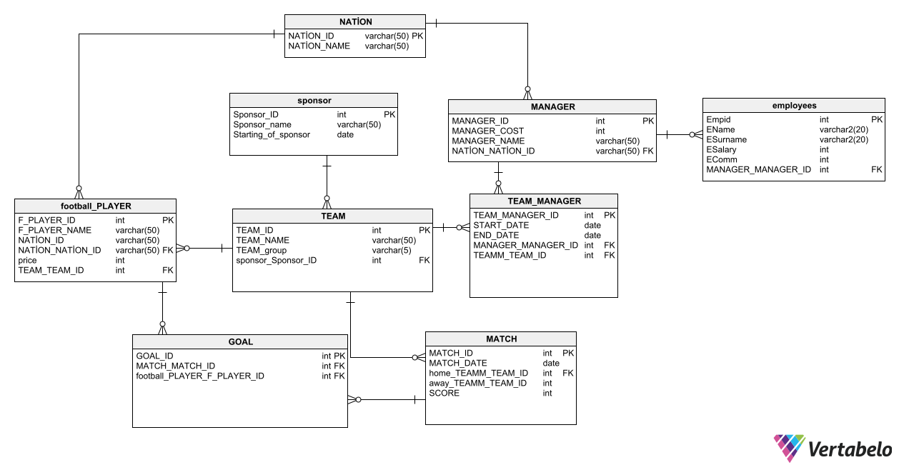

# ⚽ Football Database Project

A relational football management database developed as a **Database Systems** final project using **Oracle SQL** and **Microsoft SQL Server**.

---

## 📖 Project Overview

This project models a complete football management system that stores and manages information about football teams, players, managers, matches, goals, sponsors, employees and match requests.

The database was designed following relational database principles and demonstrates the use of constraints, stored procedures, triggers and referential integrity.

---

## ✨ Features

- ⚽ Team Management
- 👤 Football Player Management
- 👨‍💼 Manager & Employee Management
- 🏆 Match & Goal Tracking
- 💰 Sponsor Management
- 📅 Match Request Management
- 🔗 Relational Database Design
- ⚙️ Stored Procedures
- 🚀 Database Triggers
- 🔒 Primary & Foreign Keys
- 📊 Oracle SQL & SQL Server Support

---

## 🗄️ Database Structure

Main database entities:

- Nation
- Team
- Football Player
- Manager
- Employee
- Team Manager
- Match
- Goal
- Sponsor
- Match Request

---

## 📊 Entity Relationship Diagram (ERD)

<p align="center">
    
</p>

---

## 🛠️ Technologies

- Oracle SQL
- Microsoft SQL Server
- PL/SQL
- T-SQL
- Relational Database Design
- Stored Procedures
- Database Triggers

---

## 📁 Repository Structure

```text
football-database-project/
   
├── sql/ docs/
│   └── Football_Database_Project_Report.pdf
│
├── screenshots/
│   └── er-diagram.png
│
└── README.md
```

---

## 📄 Project Documentation

The complete project documentation is included in the **docs** folder.

The report contains:

- Database Design
- Entity Relationship Diagram (ERD)
- Table Definitions
- SQL Scripts
- Stored Procedures
- Database Triggers
- Implementation Details

---

## 🎯 Learning Outcomes

This project demonstrates practical knowledge of:

- Relational Database Modeling
- SQL Development
- Oracle PL/SQL Programming
- SQL Server T-SQL
- Constraints & Referential Integrity
- Stored Procedures
- Database Triggers

---

## 👨‍💻 Author

**Furkan Taha Ünal**

Computer Engineering Student  
Polish-Japanese Academy of Information Technology (PJATK)

---

⭐ If you found this project interesting, feel free to explore the repository.
